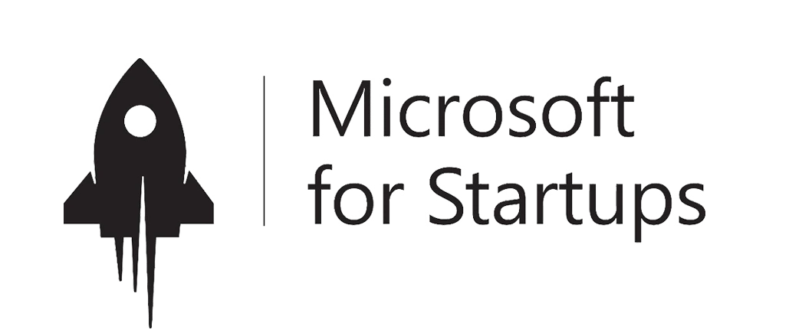

## About Me
I am the Founder of [VideoDubber.ai](https://videodubber.ai), [SEOBlogger.ai](https://seoblogger.ai), and [Discorder.tools](https://discorder.tools). I hold a Ph.D. and was a TCS research fellow in the department of [Computer Science and Engineering](http://cse.iitkgp.ac.in) at [IIT Kharagpur, India](http://www.iitkgp.ac.in/), jointly supervised by [Prof. Animesh Mukherjee](https://cse.iitkgp.ac.in/~animeshm/) and [Prof. Pawan Goyal](https://cse.iitkgp.ac.in/~pawang/). My research focused on Applied Deep Learning—Cross-Domain Few-Shot Learning, Sentiment Analysis, and Media Bias.

I was part of the [Complex Networks Research Group](http://www.cnergres.iitkgp.ac.in/) at [IIT Kharagpur](http://www.iitkgp.ac.in/).

## [VideoDubber.ai](https://videodubber.ai)

**Founder** — AI video translation, dubbing, voice cloning, and subtitle tools for creators and businesses worldwide.

### Why choose [VideoDubber.ai](https://videodubber.ai)?

- We are about 3x [cheaper](https://videodubber.ai/pricing/) than anyone in the market right now and we will remain the cheapest option for premium video translation with AI.
- Our outputs are far more superior than other competitors. We will soon publish a blog post comparing us with others. Take our word for it till then. Thank us later.
- We offer free service for short videos. No watermark is added. Test our quality just by creating an account.
- We offer state of the art voice cloning services for free backed by our own research (no third party API)
- Our UI is super smooth and mobile-friendly.
- Our customer support is super active at [contact@videodubber.ai](mailto:contact@videodubber.ai)
- Embed your subtitles, lipsync and edit subtitles in seconds with [VideoDubber.ai](https://videodubber.ai)
- You can request us any new feature you need. We are super-accessible unlike other big companies focusing on profit. Our focus is 100% customer satisfaction.

### [VideoDubber.ai](https://videodubber.ai) is supported by:

  
  
  

## [SEOBlogger.ai](https://seoblogger.ai)

**Founder** — AI-powered SEO content automation that helps businesses rank on Google and get recommended by ChatGPT on autopilot.

- **Daily SEO articles**: Keyword research, generation, optimization, images, and localization in one platform—published automatically to WordPress, Webflow, Shopify, Notion, Wix, Framer, and more.
- **Backlink Exchange**: Quality backlinks from a network of publishers to grow Domain Rating and organic traffic.
- **Scale globally**: 150+ languages, multi-site packages, team collaboration, and AI rewrites—50k+ articles created on the platform.

[Get started free →](https://seoblogger.ai)

## [Discorder.tools](https://discorder.tools)

**Founder** — Free Discord utilities and generators for creators, moderators, and communities.

### Featured tools

| Tool | What it does |
|------|----------------|
| [ID Lookup](https://discorder.tools/discord-id-lookup/) | Find and verify Discord user and server IDs quickly for moderation, bots, and community management. |
| [PFP Downloader](https://discorder.tools/discord-pfp-downloader/) | Download Discord profile pictures and banners in HD—view and save any user avatar or banner for free. |
| [Font Generator](https://discorder.tools/discord-font-generator/) | Generate fancy, bold, italic, cursive, gothic, and zalgo Unicode text for messages, nicknames, and bios. |
| [Colored Text Generator](https://discorder.tools/discord-colored-text-generator/) | Create colored, styled Discord messages that stand out in chats and servers—copy and paste in one click. |
| [Timestamp Generator](https://discorder.tools/discord-timestamp-generator/) | Build Discord timestamp codes for any date/time (relative, short date, long date, and more). |

[Explore all tools →](https://discorder.tools)

## Research
* **Fewshot Learning from text for Multimodal Sentiment Analysis** 
\*Work in Progress
* **(Im)balance in the Representation of News: An Extensive Study on a Decade Long Dataset from India** 
\*Reviews Awaited
* **A Leopard Can Not Change Its Spots: Few-shot Learning for Political Ideology Detection** 
\*Reviews Awaited

* "[**Mining the online infosphere: A survey**](https://arxiv.org/abs/2101.00454)" 
Souvic Chakraborty, Sayantan Adak, Paramtia Das, Mithun Das, Abhisek Dash, Rima Hazra, Binny Mathew, Punyajoy Saha, Soumya Sarkar, Animesh Mukherjee_ 
WIREs Data Mining and Knowledge Discovery  

* "[**Aspect-based Sentiment Analysis of Scientific Reviews**](https://dl.acm.org/doi/abs/10.1145/3383583.3398541)" 
**Souvic Chakraborty**, Pawan Goyal, Animesh Mukherjee_ 
Proceedings of the ACM/IEEE Joint Conference on Digital Libraries in 2020(**ACM JCDL-2020**) (Oral Presentation), Wuhan, China  
([DOI](https://doi.org/10.1145/3383583.3398541))

## Education
* **Indian Institute of Technology Kharagpur ([IITKGP](http://iitkgp.ac.in/)) _From 2019_** 
PhD Scholar (TCS Research Fellow), Department of Computer Science and Engineering 

* **Indian Institute of Technology Kharagpur ([IITKGP](http://iitkgp.ac.in/)) _2018-19_** 
Project Scientist, Department of Computer Science and Engineering 

* **Indian Institute of Technology Kharagpur ([IITKGP](http://iitkgp.ac.in/)) _2012-2016_**  
Bachelor of Technology in Electronics & Electrical Communication  

* **Higher Secondary Board _2012_** 
Council of Higher Secondary Education, West Bengal 
_Score 90.40 %, **2nd Topper in the State of West Bengal in WBJEE**_

* **Secondary Board _2010_** 
Board of Secondary Education, West Bengal 
_Score 90.63 %_

## Experience
* **IIT Kharagpur _Jan'19-now_** 
PhD Research Scholar, Dept. of Computer Science and Engineering
_(Under Prof. Animesh Mukherjee)_ 
* **IIT Kharagpur _July'18-Dec'18_** 
Project Scientist, Dept. of Computer Science and Engineering
_(Under Prof. Animesh Mukherjee)_ 
* **Altisource Labs _Jan'17-July'18_** 
Lead, Data Science
* **Altisource Labs _June'16-Jan'17_** 
Analyst, Data Science

## Teaching Experience (Teaching Assistant)
* **AI and Ethics (CS60016)**, Spring 2021, IIT Kharagpur
* **Programming and Data Structures (CS10003)**, Autumn 2020, IIT Kharagpur
* **Algorithms I (CS21003)**, Autumn 2019, IIT Kharagpur

## Awards and Achievements
* **Facebook Ethics in AI _2019_**(https://research.fb.com/programs/research-awards/proposals/ethics-in-ai-research-awards-india/) 
* **TCS Research Fellowship _2019_** 
Tata Consultancy Services (TCS) has awarded fellowship for research on "Citation Networks"
* **Corporate Praise & Promotion** 
Was reviewed as "excellent" and was **promoted twice** in the company in less than 9 months.
* **State Entrance Exam Topper _2012_** 
Secured 2nd Rank in the State (West Bengal) in WBJEE 2012

## PC Member
* **EMNLP 2021)**
* **NAACL 2021**
* **Journal, Springer Nature**

## Sub-reviewer
* EACL 2021
* EMNLP 2020
* ACL 2020
* WWW 2020

## Volunteer
* **AAAI,2021**

## News Coverage
* [Hindustan Times](https://www.hindustantimes.com/tech/facebook-picks-6-projects-from-india-for-ethics-in-ai-research-awards/story-nCHN7DdIJiNrLK4r2IDp2N.html)
* [NDTV](https://www.ndtv.com/education/iit-kharagpur-faculty-wins-facebook-award-for-research-in-targeted-media-bias-2108792)
* [Financial Express](https://www.financialexpress.com/education-2/facebook-award-for-iit-kharagpur-faculty-for-research-in-targeted-media-bias/1720503/)
* For a complete list refer [here](https://docs.google.com/document/d/1QjY_zEAEgCRdpw2OKkqNe4PaG8fLHfAqpbdnWDlIHzU/edit?usp=sharing)

## Relevant CourseWork
Reinforcement Learning, Deep Learning Foundation and Applications, Speech and Natural Language Processing, Deep Learning, Social Computing, Pattern Recognition and Machine Learning, Algorithm Design and Analysis, Data Structure and Algorithms

## Contact 
_Email:_ chakra.souvic@gmail.com 
_Ph:_ +91 9591058978
